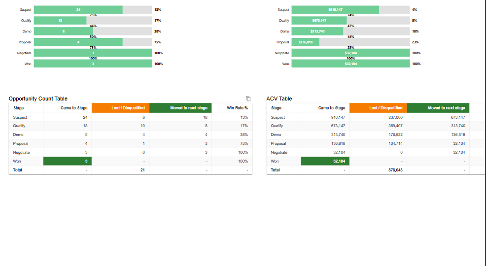
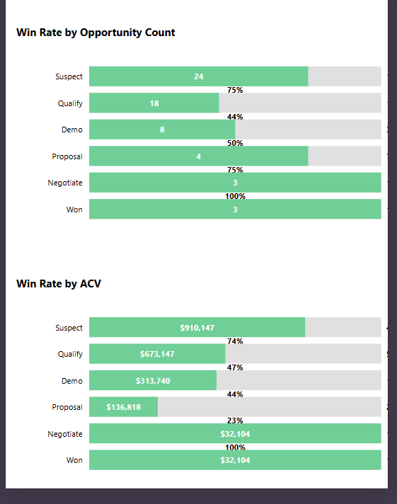
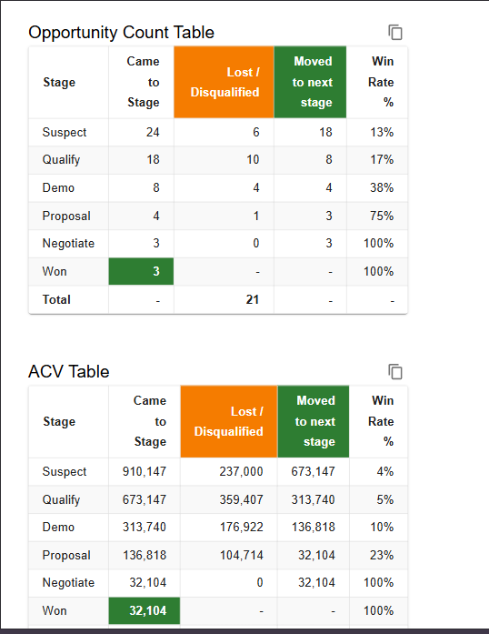
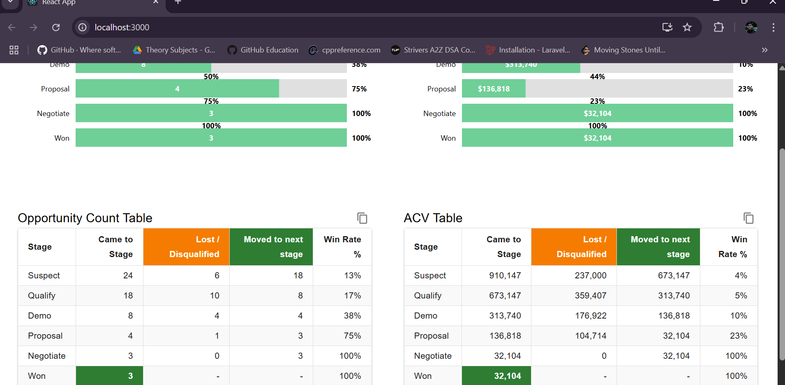
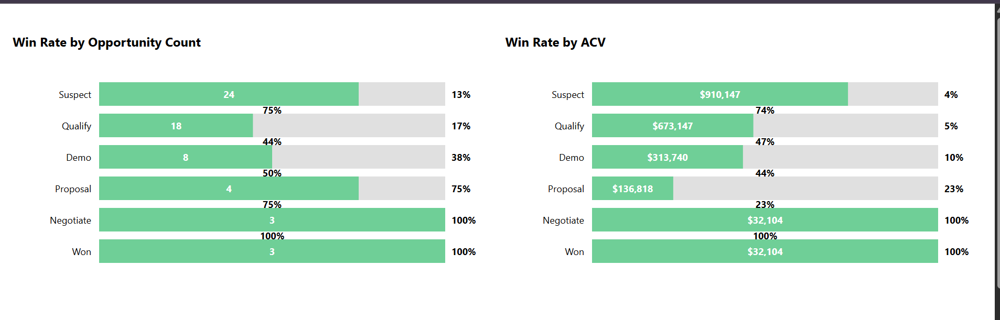
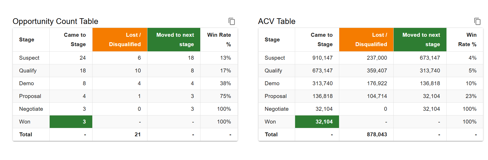

# 🌐 Skygeni Assignment

This project is a full-stack web application built for an assignment. It consists of a **React.js frontend** and an **Express.js backend**. The app displays pipeline data using D3.js charts and Material UI tables.

---

## 🚀 Live Demo

- 🔗 Frontend: [https://skygeni-assignment-five.vercel.app/](https://skygeni-assignment-five.vercel.app/)
- 🔗 Backend API: [https://skygeni-assignment-jok3.onrender.com/api/pipeline-data](https://skygeni-assignment-jok3.onrender.com/api/pipeline-data)

---

## 📸 Screenshots








---

## ⚙️ Features

- 📊 D3.js stacked bar chart for visualizing stage-wise metrics
- 📋 Material UI tables for count and ACV data
- 🔄 Express backend that processes raw JSON data
- 🚀 Fully deployed and accessible frontend/backend

---

## 🧑‍💻 Tech Stack

- **Frontend:** React.js, Axios, D3.js, Material UI
- **Backend:** Node.js, Express.js
- **Deployment:** Vercel (Frontend), Render (Backend)

---

## 🛠️ Getting Started

### 1. Clone the repository

```bash
git clone https://github.com/Raghavgupta2003/Skygeni-assignment.git
cd Skygeni-assignment

##start the backend
cd backend
npm install
node server.js
##Runs on: http://localhost:5000/api/pipeline-data

##start the frontend
cd frontend
npm install
npm start
##Runs on: http://localhost:3000
##Make sure to update the backend URL in frontend/src/services/fetchPipelineData.js if running locally.
```

📦 Deployment Info
✅ Frontend: Deployed using Vercel

✅ Backend: Deployed on Render

📧 Contact
Built with 💙 by Raghav Gupta


